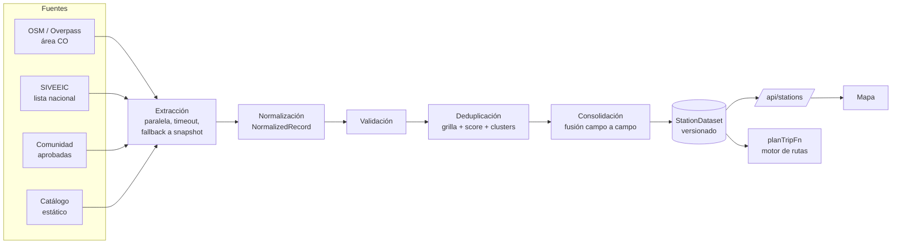

# Voltia — Plan de electrolineras consolidadas

2026-09-25 · Weymar

## Resumen

Hoy no existe un listado único de electrolineras: cada planificación consulta OSM, PlugShare y SIVEEIC **por corredor**, las mezcla con `uniqueByProximity` (se queda con el primer registro y descarta el resto, sin fusionar datos) y el mapa arma **otra** red distinta en el cliente (`useChargerNetwork`). Este plan reemplaza eso por una capa que, al arrancar, carga todas las electrolineras de Colombia desde cada fuente, las normaliza, valida, deduplica y fusiona en **un dataset versionado** que consumen por igual el mapa y el motor de rutas. Nada de código cambia hasta que apruebes este plan.

Decisiones ya tomadas contigo:

1. Se implementa en `voltia-local`. `voltia-ev-coverage` queda como banco de pruebas, sin cambios.
2. Alcance: **toda Colombia** en una sola carga.
3. Consolidación y caché **en el servidor**, con snapshot persistente y fallback por fuente.
4. Conector sin potencia reportada → **no se usa para planificar** (se muestra en el mapa).
5. `chargers.catalog.ts` sigue como **fuente estática marcada**: solo Colombia (salen las 3 IONITY de España) y sus conectores quedan como "no confirmados".
6. Fuentes v1: **OpenStreetMap + SIVEEIC** (más comunidad y catálogo, que son internas). OpenChargeMap y PlugShare quedan como adaptadores futuros: la arquitectura los admite sin tocar nada más.
7. La rama base la defines tú (hay trabajo de SIVEEIC sin commitear en `feat/cache-improving`).

## 1. Lo que encontré en el código

| Pieza | Archivo | Problema frente al objetivo |
| --- | --- | --- |
| Carga por corredor | `chargers.cache.ts`, `plan.ts` | No hay carga inicial ni listado global; cada ruta pide sus propias estaciones |
| Dedup | `domain/geo.ts` → `uniqueByProximity` | Solo distancia (0,10 / 0,12 / 0,18 km según el sitio); descarta, no fusiona; no mira nombre, dirección ni IDs |
| Datos inventados — OSM | `chargers.overpass.ts` → `socketsFromTags` | Sin etiquetas `socket:*` agrega "Tipo 2 22 kW"; si la marca dice Tesla agrega 8 NACS + 4 CCS2 |
| Datos inventados — potencias | `chargers.siveeic.ts`, `chargers.plugshare.ts` | `DEFAULT_KW` / `defaultKw()` (50/22/60/150 kW) cuando la fuente no trae potencia |
| Datos asumidos — catálogo | `chargers.catalog.ts` | Los 19 Voltex comparten `2×CCS2 50 kW + Tipo 2 22 kW` y horario 24/7 |
| Campos perdidos | todos los adaptadores | SIVEEIC descarta horario, archivos y demás campos; OSM descarta todas las etiquetas no mapeadas; no hay teléfono, web, servicios, corriente AC/DC ni estado por conector |
| Overpass | `chargers.overpass.ts` | Solo `node` (se pierden estaciones mapeadas como `way`) |
| Dos redes distintas | `use-charger-network.ts` vs `plan.ts` | El mapa mezcla comunidad + PlugShare por viewport + resultado del plan + catálogo; el planificador usa otra mezcla |
| Mapa | `leaflet-map.tsx` → `cullChargers` | A zoom bajo **muestrea** marcadores (oculta estaciones reales); todos los marcadores se ven iguales |
| Arranque | `instrumentation.ts` | `register()` vacío: hoy no se hace nada al iniciar |

Lo que se reutiliza: `fetchJson` (reintentos, timeouts, User-Agent), el patrón de caché en Postgres de `charger_corridor_cache`, `isVerifiedForPlanning`/`hasValidCoords` como base de la validación, `buildPlan` sin cambios internos (sigue recibiendo `Charger[]`), `ChargerFacts` como punto de partida del panel de detalle.

## 2. Flujo



## 3. Arquitectura

```
src/domain/stations/                 puro, sin I/O, 100 % testeable (entra en el umbral de cobertura)
  model.ts          NormalizedRecord, ConsolidatedStation, StationConnector, StationDataset
  connectors.ts     etiqueta de la fuente → estándar; corriente según el estándar
  text.ts           normalización de nombres y direcciones (acentos, "Cra"/"Kr"/"Carrera", "#", "EDS"…)
  validate.ts       reglas de validez con razón de rechazo
  dedupe.ts         índice por grilla, score de pares, clustering con guardas
  merge.ts          fusión campo a campo con prioridades y registro de conflictos
  eligibility.ts    ¿sirve para planificar? + razones
  consolidate.ts    NormalizedRecord[] → StationDataset (orquesta lo anterior, calcula la versión)
  spatial.ts        índice espacial para "estaciones a ≤ X km de la ruta"
  to-charger.ts     ConsolidatedStation → Charger del planificador (solo conectores elegibles)

src/infrastructure/stations/
  sources/types.ts  contrato StationSource
  sources/osm.ts  sources/siveeic.ts  sources/community.ts  sources/catalog.ts
  registry.ts       ÚNICO lugar donde se agregan o quitan fuentes
  extract.ts        corre las fuentes en paralelo (allSettled + timeout por fuente)
  store.ts          snapshots por fuente y dataset en Postgres + memoria del proceso
  service.ts        getStationDataset() / refreshStationDataset() con single-flight

src/app/api/stations/route.ts            GET listado (ETag = versión)
src/app/api/stations/[id]/route.ts       GET detalle completo (atributos crudos, conflictos)
src/app/api/stations/refresh/route.ts    POST, protegido con CRON_SECRET
src/app/api/stations/report/route.ts     GET, solo admin: diagnóstico de la última consolidación

src/components/stations/
  use-station-dataset.ts   React Query, precargado al abrir la app
  station-markers.tsx      marcadores + clustering
  station-detail.tsx       panel de detalle
  station-legend.tsx
```

Contrato de una fuente — agregar OpenChargeMap o PlugShare después es escribir un archivo e incluirlo en `registry.ts`:

```ts
interface StationSource {
  id: SourceId;                       // "osm" | "siveeic" | "community" | "catalog" | …
  label: string;
  enabled(): boolean;                 // p. ej. false si falta el token
  timeoutMs: number;
  ttlMs: number;                      // cada cuánto vale la pena refrescarla
  fetchAll(signal: AbortSignal): Promise<NormalizedRecord[]>;
}
```

## 4. Modelo de datos

```ts
type CurrentType = "AC" | "DC";

interface StationConnector {
  standard: ConnectorType | "type1" | "schuko" | "tesla_destination" | "other";
  rawLabel: string;                   // tal cual lo trae la fuente
  quantity: number | null;            // null = la fuente no lo dice
  powerKw: number | null;             // SOLO si la fuente lo reporta
  current: CurrentType | null;
  currentOrigin: "reported" | "standard" | null;  // "standard": CCS/CHAdeMO/GB-T DC ⇒ DC, Tipo 2 ⇒ AC
  voltageV: number | null;
  amperageA: number | null;
  status: StationAvailability;        // "unknown" si la fuente no lo da
  confirmed: boolean;                 // false para el catálogo estático
  sources: SourceId[];
}

interface SourceRef {
  source: SourceId;
  externalId: string;                 // "node/123", Id de SIVEEIC, id de la fila en electrolineras…
  url?: string;                       // osm.org/node/123, ficha SIVEEIC si existe
  fetchedAt: string;
  sourceUpdatedAt?: string;
}

interface ConsolidatedStation {
  id: string;                         // "st_" + hash del SourceRef de mayor prioridad: estable entre refrescos
  name: string;
  aliases: string[];                  // los otros nombres con que lo conocen las fuentes
  lat: number; lon: number;
  coordSource: SourceId;
  address?: { full?: string; street?: string; city?: string; department?: string };
  operator?: string; network?: string; brand?: string;
  openingHours?: string;
  phone?: string; website?: string; email?: string;
  pricing?: { text?: string; perKwh?: { amount: number; currency: string }; free?: boolean };
  access?: "public" | "customers" | "restricted" | "private";
  services: string[];                 // parqueadero, baños, tienda, wifi… cuando la fuente lo dice
  availability: { value: StationAvailability; source?: SourceId; at?: string };
  connectors: StationConnector[];
  sources: SourceRef[];
  attributes: Partial<Record<SourceId, Record<string, string | number | boolean>>>; // todo lo demás, crudo
  conflicts: { field: string; values: { source: SourceId; value: unknown }[] }[];
  planning: { eligible: boolean; reasons: string[] };
}

interface StationDataset {
  version: string;                    // hash del contenido
  generatedAt: string;
  stations: ConsolidatedStation[];
  sources: {
    id: SourceId; ok: boolean; stale: boolean; fetchedAt?: string;
    records: number; accepted: number; rejected: Record<string, number>;
    error?: string; durationMs?: number;
  }[];
  stats: { raw: number; valid: number; stations: number; merged: number; eligible: number };
}
```

"Mantener todos los campos": cada adaptador mapea lo que tiene equivalente en el modelo y **todo el resto** va a `attributes[source]` (todas las etiquetas OSM; todos los campos de SIVEEIC salvo la geometría binaria). El panel de detalle los muestra en "Otros datos".

## 5. Extracción por fuente (v1)

| Fuente | Consulta | Timeout / TTL | Notas |
| --- | --- | --- | --- |
| OSM | `area["ISO3166-1"="CO"][admin_level=2]->.co; nwr["amenity"="charging_station"](area.co); out center tags;` | 60 s / 6 h | `nwr` en vez de solo `node`; dos espejos de Overpass como hoy. Se excluyen elementos con prefijos de ciclo de vida (`disused:`, `abandoned:`, `construction:`, `planned:`) y se registran en el reporte |
| SIVEEIC | `/crg/resumenestacionescarga/0/0` (lista nacional) | 20 s / 6 h | Se porta tu adaptador; `Estado ≠ activo` se rechaza con razón. SIVEEIC trae cantidad por conector pero **no potencia**. En la fase 2 reviso si expone un detalle por estación con potencia |
| Comunidad | tabla `electrolineras`, `status = approved` | 5 s / en vivo | Las `pending` no entran al dataset público; los admin las siguen viendo en su capa de moderación |
| Catálogo | `chargers.catalog.ts`, solo Colombia | — | Conectores con `confirmed: false` y `powerKw: null` en el modelo (el valor asumido se conserva en `attributes.catalog` como referencia) |

Manejo de errores: `Promise.allSettled` con `AbortSignal.timeout` por fuente. Si una fuente falla o tarda, se usa **su último snapshot válido** (marcado `stale` con su edad en `dataset.sources`); si nunca tuvo uno, entra vacía con aviso. Una fuente caída nunca impide consolidar las demás.

## 6. Normalización y validación

- Conectores: una sola tabla de mapeo (`connectors.ts`) para todas las fuentes. OSM `socket:type2_combo` y SIVEEIC "CCS Combo 2" ⇒ `ccs2`; lo desconocido queda como `other` con su `rawLabel`, no se descarta.
- Potencia: se parsea solo lo reportado (`socket:*:output`, "50 kW", "50000 W"). **Se eliminan todos los valores por defecto** (`DEFAULT_KW`, `defaultKw`, el fallback de `socketsFromTags`).
- Corriente: reportada si la fuente la da; si no, derivada del estándar (es la definición del conector, no una suposición) y marcada `currentOrigin: "standard"`.
- Validación con razón de rechazo (va al reporte): coordenadas no finitas, `0,0`, o fuera de Colombia (bbox con margen); sin nombre y sin operador; fuera de servicio / planeada / en construcción; duplicado exacto dentro de la misma fuente.

## 7. Deduplicación

1. **Mismo ID externo** (misma fuente o referencia cruzada como `ref:*` en OSM) ⇒ mismo registro, sin mirar nada más.
2. **Candidatos**: índice por grilla de ~550 m; solo se comparan registros en celdas vecinas.
3. **Score del par** según la distancia `d`:
   - `d > 300 m` ⇒ nunca se fusionan.
   - `d ≤ 25 m` ⇒ se fusionan, salvo que ambos tengan operador y los operadores sean distintos.
   - `25 m < d ≤ 150 m` ⇒ se fusionan si similitud de nombre ≥ 0,6, o dirección ≥ 0,7, o mismo operador con nombre ≥ 0,4 o dirección ≥ 0,5.
   - `150 m < d ≤ 300 m` ⇒ solo con nombre ≥ 0,8 y operador compatible (cubre coordenadas de SIVEEIC geocodificadas desde la dirección).
   - Nombre: minúsculas, sin acentos, sin palabras vacías ("estación", "carga", "electrolinera", "EDS", "punto", "S.A.S."…), máximo entre Jaccard de tokens y Dice de trigramas. Dirección: abreviaturas colombianas normalizadas y comparación de los números de la placa.
4. **Clusters** con union-find y dos guardas contra el encadenamiento: diámetro del cluster ≤ 300 m, y dos registros de la **misma fuente** con IDs distintos solo se unen si están a ≤ 50 m con mismo operador o nombre (OSM a veces mapea un nodo por cargador en el mismo parqueadero).
5. Los umbrales viven en una constante y se ajustan con el reporte (sección 9); las fusiones en la banda 150–300 m y los "casi" (pares rechazados por poco) se listan para revisión manual.

## 8. Consolidación (fusión campo a campo)

Cada campo toma el valor de la fuente con mayor prioridad **que lo tenga**; los demás valores distintos se guardan en `conflicts`, y los nombres alternos en `aliases`.

| Campo | Prioridad |
| --- | --- |
| Coordenadas | OSM → comunidad → catálogo → SIVEEIC (conflicto si difieren > 50 m) |
| Nombre, operador, dirección | SIVEEIC (registro oficial) → comunidad → OSM → catálogo |
| Horario, teléfono, web, servicios, precio | comunidad → OSM → SIVEEIC → catálogo |
| Disponibilidad | solo fuentes con dato en vivo o fechado (hoy: comunidad); si no, `unknown` |
| Conectores | agrupados por estándar: potencia del registro que la reporte, cantidad de SIVEEIC → comunidad → OSM; `confirmed` si al menos una fuente no-catálogo lo reporta. Nunca se toma potencia de otra estación |

Las prioridades son configuración, no código disperso: se ajustan en un solo objeto.

## 9. Almacenamiento, caché y arranque

- **Migración `0012_station_dataset.sql`**: `station_source_snapshots (source_id pk, records jsonb, fetched_at, ok, error)` y `station_dataset (id = 'current', version, dataset jsonb, generated_at)`. Mismo patrón de seguridad que `charger_corridor_cache` (RLS activo, sin acceso anon/authenticated). En Vercel el disco es efímero, por eso el snapshot va en Postgres y no en un archivo JSON.
- **Servicio**: `getStationDataset()` devuelve primero memoria, luego Postgres. Si el dataset es más viejo que el TTL, sirve el actual y dispara un refresco en segundo plano (single-flight con `pg_try_advisory_lock` para que dos instancias no refresquen a la vez).
- **Refresco programado**: `POST /api/stations/refresh` con `CRON_SECRET`, llamado por un cron de Vercel cada 6 h (`vercel.json`), más `npm run stations:refresh` para sembrarlo en local o tras desplegar.
- **Al iniciar la aplicación**:
  - Servidor: `instrumentation.ts` precarga el dataset desde Postgres a memoria (no llama a las fuentes, para no bloquear el arranque).
  - Cliente: `Providers` hace `prefetchQuery(["stations"])` al montar la app; mapa y demás componentes leen `useStationDataset()` (staleTime 30 min, revalida con ETag → 304).
- **API**: `/api/stations` envía todo menos `attributes` y `conflicts` (estimado < 300 KB gzip para Colombia); `/api/stations/[id]` los incluye.
- **Verificable**: `/api/stations/report` (admin) y `npm run stations:report` muestran por fuente: registros, aceptados, rechazados por razón, fusiones por banda de distancia, conflictos y cuántas estaciones son elegibles para planificar.

## 10. Mapa

- Una fuente de datos: `useStationDataset()` reemplaza `useChargerNetwork`. Se retira la capa de PlugShare por viewport (hoy no hay token y, al ser una red aparte, generaría duplicados en el mapa).
- **Un marcador = una ConsolidatedStation.** El muestreo de `cullChargers` se reemplaza por clustering (propongo `supercluster`, ~7 KB); al acercar se ven todas las estaciones, nunca se ocultan.
- Codificación visual por potencia máxima **reportada**: DC ≥ 50 kW, DC < 50 kW, solo AC, y "sin potencia reportada" (hueco/gris). Anillo rojo si está fuera de servicio, atenuado si no es elegible para planificar. Leyenda en el mapa.
- **Panel de detalle** (`station-detail.tsx`, crece desde `ChargerFacts`): nombre y alias; dirección; coordenadas copiables; operador/red; horario; precio; teléfono; web; servicios; acceso; tabla de conectores (tipo · cantidad · potencia · AC/DC · estado · fuente); "Se usa / no se usa para planificar" con las razones; fuentes con ID externo, enlace y fecha; conflictos; "Otros datos" con los atributos crudos.
- Las paradas de la ruta siguen dibujándose aparte, pero con el mismo `id` que su marcador.

## 11. Motor de rutas

- `planTripFn` deja de llamar a `findCachedChargersAlong`: toma `getStationDataset()`, filtra con `spatial.ts` las estaciones a ≤ `MAX_FROM_ROUTE_KM` de cualquiera de las rutas, y pasa `toPlanningCharger()` de las **elegibles** a `buildPlan` (que no cambia por dentro).
- **Elegible para planificar** si: coordenadas válidas en Colombia, operativa, acceso no privado, comunidad solo aprobada, y al menos un conector de un estándar soportado **con potencia reportada** y confirmado. `toPlanningCharger` solo pasa esos conectores.
- `PlanResponse.geo` incluye `stationsVersion`; cada parada lleva el `id` consolidado.
- Invariantes con tests: toda parada de un plan existe en el dataset; ningún conector usado tiene potencia `null` o de catálogo sin confirmar; con un dataset vacío el plan nunca inventa una parada (devuelve el `NO_VERIFIED_STOP_REASON` actual).
- `scoreCharger`: el bonus por fuente pasa a un bonus por confianza (estación confirmada por 2+ fuentes).
- Se retiran `chargers.cache.ts`, los `findAlong` de los proveedores y la tabla `charger_corridor_cache` (migración aparte, al final).

## 12. Fases

Una rama y un PR por fase, desde la base que me indiques.

| Fase | Rama | Contenido | Cómo se verifica |
| --- | --- | --- | --- |
| 1 | `feat/estaciones-dominio` | `src/domain/stations/*` completo | Tests con fixtures: duplicados reales (p. ej. Voltex Chimitá, que está en el catálogo y como nodo Terpel en OSM), estaciones vecinas distintas en un mismo centro comercial, encadenamiento, conflictos. Cobertura ≥ 80 % |
| 2 | `feat/estaciones-fuentes` | Adaptadores OSM, SIVEEIC, comunidad, catálogo; se eliminan los valores por defecto | Tests con respuestas grabadas; ningún conector sale con potencia que la fuente no trajo |
| 3 | `feat/estaciones-cache-api` | Migración 0012, store, servicio, rutas `/api/stations*`, cron, `stations:refresh`, `stations:report`, precarga en `instrumentation.ts` | Correr el reporte contra datos reales y revisar contigo fusiones, conflictos y **cuántas quedan elegibles** antes de seguir |
| 4 | `feat/estaciones-mapa` | Hook, clustering, colores, leyenda, panel de detalle; retiro de `useChargerNetwork` y de la capa PlugShare | Revisión visual en `/` y `/electrolineras`; conteo de marcadores = `stats.stations` |
| 5 | `feat/estaciones-planificador` | `planTripFn` sobre el dataset, elegibilidad, `stationsVersion`, invariantes; retiro del caché por corredor | Tests de invariantes + las rutas de `diagnose:route` comparadas antes/después |
| 6 | `chore/estaciones-limpieza` | Migración que borra `charger_corridor_cache`, README, `.env.example` (`CRON_SECRET`), AGENTS.md | CI completo |

## 13. Riesgos

1. **Menos paradas disponibles.** Con la regla "sin potencia no se planifica", SIVEEIC por sí solo no aporta paradas (no trae potencia) y muchas estaciones de OSM Colombia no tienen `socket:*:output`. Algunas rutas que hoy "funcionan" gracias a los 22/50 kW inventados van a mostrar "no se encontró electrolinera verificada". Es el resultado honesto; el reporte de la fase 3 lo cuantifica antes de cambiar el planificador. Mitigaciones: OpenChargeMap (suele traer `PowerKW`), PlugShare con licencia, y que la comunidad complete potencias.
2. **Overpass nacional** puede tardar o dar 429. Mitigación: cron fuera del camino del usuario, dos espejos, snapshot anterior como respaldo.
3. **Límite de tiempo en Vercel** para el refresco: la ruta de refresco declara `maxDuration = 60`; si no alcanza, se refresca por fuente en llamadas separadas.
4. **Fusiones erróneas.** Umbrales conservadores + revisión de la banda 150–300 m en el reporte. A futuro, una tabla `station_merge_overrides` para forzar o impedir fusiones a mano.
5. **IDs nuevos.** Las paradas pasan de `osm-node-…`/`siveeic-…` a `st_…`. Los viajes guardados y compartidos guardan el plan completo, así que siguen mostrándose; solo no se re-enlazan con el marcador actual.
