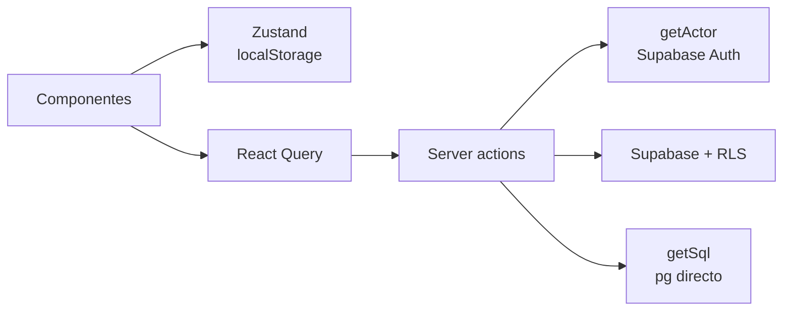
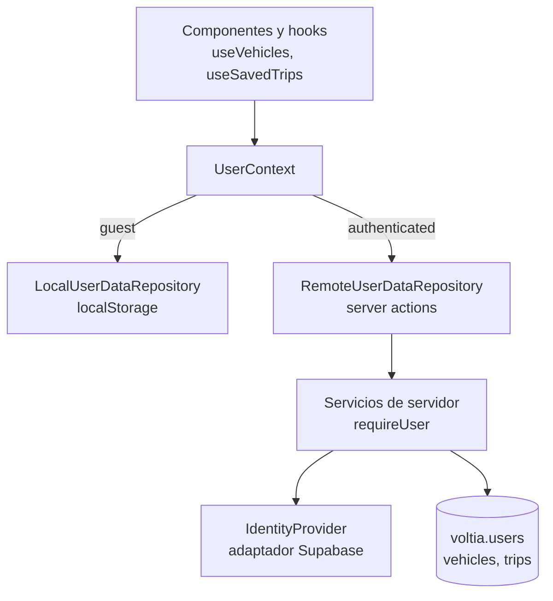
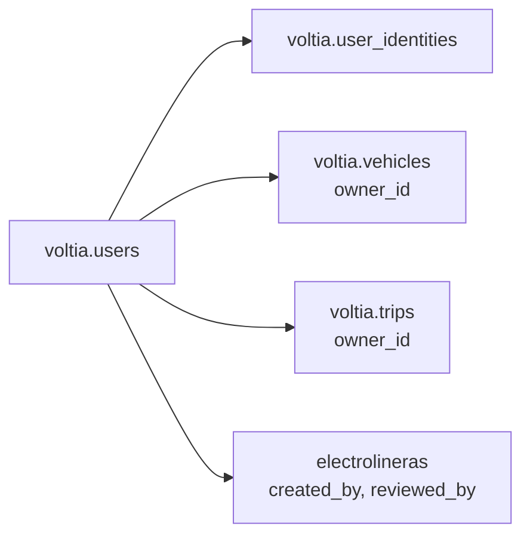
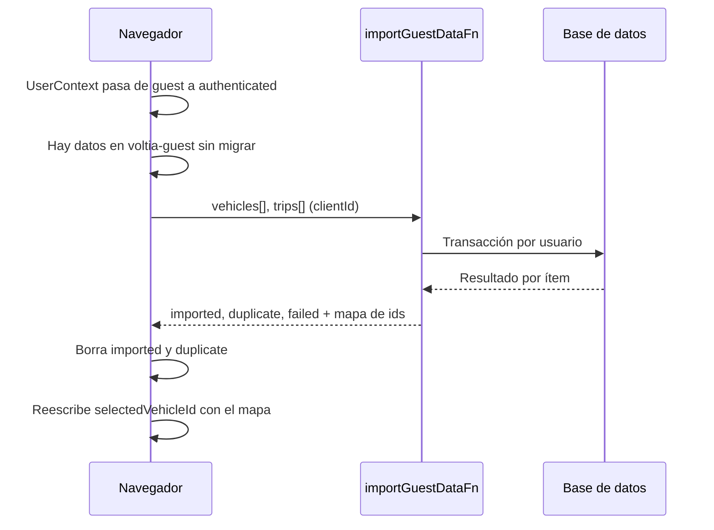
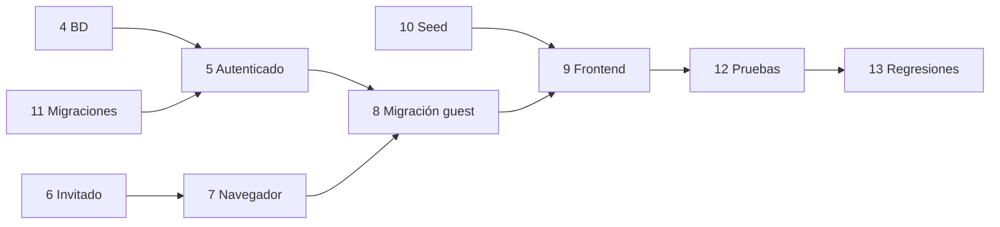

# Voltia — Plan de gestión de usuarios

2026-09-23 · Weymar

> Versión editable: https://claude.ai/code/artifact/68c45095-514d-4c32-8f2b-bf14d7bf986a

## Resumen

El plan agrega una tabla propia de usuarios desacoplada de Supabase, un contexto de usuario único (invitado o autenticado) con repositorios intercambiables, y una migración idempotente de los datos locales del invitado al iniciar sesión. Nada de código cambia hasta que apruebes las decisiones de la última sección.

Lo que encontré en el código hoy (`main` en 4db56f3):

- **No hay tabla de usuarios.** La identidad es el `auth.uid()` de Supabase, usado como `owner_id uuid` sin clave foránea en `voltia.vehicles`, `voltia.trips` y `electrolineras.created_by`.
- **Ya existe un puerto de auth** (`src/domain/auth/port.ts`: `Actor`, `AuthPort`) con rol `guest | member | admin`. Es la base natural para el contexto de usuario.
- **Los vehículos nunca llegan a la base de datos desde la UI.** `saveVehicleFn` y `listMyVehiclesFn` existen pero ningún componente los llama; todos los vehículos viven en `localStorage` (clave `voltia-planner`), también para usuarios con sesión.
- **Las rutas solo se guardan con sesión.** `SaveTripButton` devuelve `null` para invitados.
- **El catálogo tiene dos fuentes.** `VEHICLE_CATALOG` en código es lo que la app usa; `src/instrumentation.ts` lo copia a `voltia.vehicles` al arrancar, pero nadie lo lee de ahí.
- **El menú abre diálogos, no rutas.** Vehículos, Configuración y PlugShare no tienen páginas propias; quitar los botones sin más deja Configuración y PlugShare inalcanzables.
- **El modelo `Vehicle` no tiene torque.** Tiene potencia (`motorKw`), batería, autonomía, peso, carga AC/DC, conectores y curva de carga.

Decisiones clave que propongo:

1. Tabla `voltia.users` + `voltia.user_identities`; el resto de tablas apunta a `voltia.users.id`, nunca al id del proveedor.
2. Datos del invitado en `localStorage`, no en cookies. Sin registro en la base de datos.
3. Un contexto `UserContext` con dos adaptadores (`LocalUserDataRepository`, `RemoteUserDataRepository`) detrás de los mismos hooks.
4. Migración automática al iniciar sesión, idempotente por ítem, que borra lo local solo cuando el servidor confirma.
5. El catálogo pasa a leerse de la base de datos, poblado por un seed SQL rerunnable.

## Fase 1 — Arquitectura actual

La app ya separa dominio, infraestructura y server actions; el hueco está en que el estado del usuario (vehículos, preferencias) vive en un store de Zustand que no sabe nada de la sesión.

| Capa | Archivos | Qué hace hoy | Relevancia para este plan |
| --- | --- | --- | --- |
| Puerto de auth | `src/domain/auth/port.ts` | Tipos `Actor` (rol, id, email) y `AuthPort` | Se reutiliza; `Actor` sigue siendo el tipo de autorización |
| Actor en servidor | `src/infrastructure/auth/server-actor.ts` | `getActor()` con `supabase.auth.getUser()`, `requireMember()`, `requireAdmin()` por `ADMIN_EMAILS` | Pasa a resolver el id interno de `voltia.users` |
| Actor en cliente | `src/infrastructure/auth/use-actor.ts`, `src/server/actions/auth.ts` | React Query + `onAuthStateChange` | Base del nuevo `UserContext` |
| Login | `src/components/auth/sign-in-form.tsx`, `src/infrastructure/auth/supabase-auth.ts` | Enlace mágico por correo (PKCE) | Sin cambios de flujo |
| Callback | `src/app/auth/callback/route.ts` | `exchangeCodeForSession` | Aquí se aprovisiona el usuario interno |
| Sesión | `src/proxy.ts` | Refresca la cookie de Supabase en cada request | Sin cambios |
| Store | `src/lib/store.ts` | Zustand `persist` en `localStorage` (`voltia-planner`): vehículos, vehículo seleccionado, condiciones, tokens de Mapbox y PlugShare | Se divide: preferencias locales vs. datos del usuario |
| Server actions de usuario | `src/server/actions/vehicles.ts`, `trips.ts` | CRUD con `requireMember()` y RLS | Se convierten en el adaptador remoto |
| UI de rutas guardadas | `src/components/trips/*` | Guardar, Mis viajes, compartir | Pasan a usar el contexto, no la sesión |
| Dominio | `src/domain/planner.ts`, `energy.ts`, `charging.ts`, `types.ts`, `schemas.ts` | Planificación pura, sin I/O | No cambia |



La planificación (`planTripFn`) ya funciona sin sesión y no cambia. Lo que depende del tipo de usuario es solo dónde se leen y escriben vehículos, rutas y preferencias.

## Fase 2 — Modelo de datos actual

Todas las relaciones con el usuario son columnas `uuid` sueltas que guardan el id de Supabase Auth, sin clave foránea; cambiar de proveedor hoy significaría reescribir cada `owner_id`.

| Tabla (migración) | Columnas clave | Relación con usuario | RLS |
| --- | --- | --- | --- |
| `voltia.vehicles` (0003) | `id text pk`, `owner_id uuid null`, `payload jsonb` | `owner_id` = `auth.uid()`; `null` = catálogo | Catálogo legible por todos; el resto solo por su dueño |
| `voltia.trips` (0003, 0006) | `id uuid pk`, `owner_id uuid not null`, `payload jsonb`, `share_id`, `shared` | `owner_id` = `auth.uid()` | Dueño total; lectura pública si `shared = true` |
| `electrolineras` (0002, 0004) | `created_by`, `reviewed_by uuid` | Autor y moderador | Lectura pública de aprobadas |
| `rate_limits` (0005) | `key text` | Clave por IP o usuario | Sin acceso público |

Detalles que condicionan el diseño:

- **Vehículos por usuario.** El id de fila es `"<owner_id>:<vehicle.id>"` (`src/server/actions/vehicles.ts`). No hay índice único por dueño y vehículo más allá de ese texto.
- **El payload del vehículo** sigue `VehicleSchema` (`src/domain/schemas.ts`): `id`, `brand`, `model`, `year`, `version`, `batteryKwh`, `rangeKm`, `consumptionKwhPer100km`, `consumptionManual`, `weightKg`, `motorKw`, `acMaxKw`, `dcMaxKw`, `chargeCurve`, `connectors`, `minSocRecommended`, `maxSocTravel`, `isCustom`. No hay torque.
- **El payload de una ruta** es `{ request, summary }`: la petición completa (origen, destino, paradas, **copia del vehículo**, condiciones) y un resumen. La ruta no referencia al vehículo por id, lo embebe; borrar un vehículo no rompe rutas guardadas.
- **Ediciones de catálogo.** En el navegador, un vehículo con el mismo id que uno de catálogo es una versión editada de ese modelo (`mergeVehicles` en `src/lib/store.ts`). Esa regla se mantiene.
- **Rol admin** sale de `ADMIN_EMAILS`, no de la base de datos. Queda igual en este plan.

## Fase 3 — Contexto de usuario

La UI habla con un solo `UserContext` y un solo repositorio; qué adaptador hay detrás (navegador o servidor) lo decide el contexto según la sesión, así ningún componente pregunta si el usuario es invitado.



**Tipos nuevos** (en `src/domain/user/`, sin dependencias de Next ni Supabase):

```ts
type UserContext =
  | { kind: "guest"; guestId: string }
  | { kind: "authenticated"; userId: string; email: string; role: "member" | "admin" };

interface UserDataRepository {
  listVehicles(): Promise<Vehicle[]>;          // solo propios: personalizados o ediciones de catálogo
  saveVehicle(v: Vehicle): Promise<Vehicle>;
  deleteVehicle(id: string): Promise<void>;
  listTrips(): Promise<SavedTrip[]>;
  saveTrip(t: NewTrip): Promise<SavedTrip>;    // NewTrip lleva clientId (uuid)
  deleteTrip(id: string): Promise<void>;
}

interface IdentityProvider {                    // puerto de servidor
  currentIdentity(): Promise<{ provider: string; subject: string; email: string } | null>;
}
```

**Qué se reutiliza y qué cambia:**

- `Actor` y `AuthPort` quedan como están; `UserContext` se construye a partir de `useActor()` más el `guestId` local.
- `getActor()` deja de devolver `user.id` de Supabase: resuelve la identidad vía `IdentityProvider` y la mapea a `voltia.users.id`. `requireMember()` pasa a llamarse `requireUser()` (con alias temporal) y devuelve ese id interno.
- Los componentes dejan de leer `s.vehicles` del store para la lista del usuario y usan `useVehicles()`, que combina el catálogo (público, común a todos) con los vehículos del repositorio activo.
- La lógica de negocio no se duplica: la regla "mismo id que catálogo = edición" y el cálculo de duplicados viven en funciones puras de `src/domain/user/`, usadas por ambos adaptadores y por la migración.
- El store de Zustand conserva el estado de la sesión de planificación (origen, destino, planes, diálogos) y el id del vehículo seleccionado. Ya no guarda la lista de vehículos.

**Desacople del proveedor:** solo dos archivos conocen Supabase Auth: el adaptador de `IdentityProvider` y el cliente de login (`supabase-auth.ts`). Cambiar de proveedor es escribir un adaptador nuevo y registrar identidades con otro `provider`; `voltia.users.id` y todas las relaciones siguen iguales.

## Arquitectura de persistencia

Vehículos propios y rutas guardadas van a la base de datos para el usuario autenticado y al navegador para el invitado; el catálogo y las preferencias de planificación tienen un solo lugar para ambos.

| Dato | Usuario autenticado | Usuario invitado | Por qué |
| --- | --- | --- | --- |
| Identidad | `voltia.users` + `voltia.user_identities` | `guestId` (uuid) en `localStorage` | El invitado no deja registro en la BD |
| Vehículos propios (personalizados o ediciones de catálogo) | `voltia.vehicles` con `owner_id` | `localStorage` `voltia-guest` | Sigue al usuario entre dispositivos solo si tiene cuenta |
| Rutas guardadas | `voltia.trips` | `localStorage` `voltia-guest` | Ídem |
| Compartir ruta por link | `voltia.trips.share_id` | No disponible: pide iniciar sesión | Un link público necesita una fila en la BD |
| Catálogo de vehículos | `voltia.vehicles` con `owner_id null` | Igual (lectura pública) | Común a todos |
| Vehículo seleccionado, condiciones del viaje | `localStorage` `voltia-planner` | `localStorage` `voltia-planner` | Preferencia del dispositivo; ver decisión D4 |
| Token de Mapbox | `localStorage` `voltia-planner` | Igual | Ya es así; no se toca |
| Token de PlugShare | Se elimina del navegador | Se elimina | Es una credencial; queda solo `PLUGSHARE_TOKEN` en servidor |
| Planes calculados, origen/destino en curso | Memoria (Zustand, sin persistir) | Igual | Ya es así |

Relaciones en la base de datos después del cambio:



`vehicles.owner_id` y `trips.owner_id` borran en cascada con el usuario; `electrolineras.created_by` y `reviewed_by` pasan a `null` para que las estaciones aportadas sobrevivan a una cuenta borrada.

## Usuario invitado

El invitado vive entero en `localStorage` bajo una clave versionada; no se usan cookies para sus datos porque viajarían en cada request (con ubicaciones de origen y destino) y una cookie no pasa de unos 4 KB.

**Estructura local** (`localStorage["voltia-guest"]`, validada con Zod al leer):

```ts
{
  v: 1,
  guestId: string,          // crypto.randomUUID(), se crea en la primera visita
  createdAt: string,        // ISO
  lastActiveAt: string,     // se actualiza como mucho una vez al día
  vehicles: Vehicle[],      // solo personalizados o ediciones de catálogo, máx. 20
  trips: {                  // máx. 50, las más antiguas salen primero
    clientId: string,       // uuid, clave de idempotencia al migrar
    request: PlanRequest,   // igual que el payload de voltia.trips
    summary: TripSummary,
    createdAt: string
  }[],
  migration?: { userId: string; attempts: number; lastAttemptAt: string; pending: string[] }
}
```

`voltia-planner` (ya existe) queda solo con preferencias: `selectedVehicleId`, `conditions`, `mapboxToken`.

**Qué nunca se guarda en el navegador ni en cookies:** tokens de API (se elimina el de PlugShare que hoy está en `localStorage`), email, ids de Supabase ni datos de otros usuarios. El `guestId` es aleatorio y no identifica a nadie fuera de este navegador.

**Expiración y limpieza:**

- Al cargar la app, si `lastActiveAt` tiene más de 180 días, se borra `voltia-guest` y se crea un invitado nuevo. Las preferencias de `voltia-planner` se conservan.
- En el menú, para invitados: "Borrar mis datos de este navegador" (confirmación y borrado de `voltia-guest`).
- Al llegar al límite de 50 rutas o 20 vehículos, se avisa y se ofrece iniciar sesión; no se borra nada sin decirlo.
- Si el navegador rechaza la escritura (`QuotaExceededError`, modo privado), la app sigue funcionando en memoria y muestra un aviso una vez.
- Datos corruptos o de una versión desconocida: se guardan en `voltia-guest-corrupt` para diagnóstico y se empieza limpio.

**Riesgo conocido:** Safari borra el almacenamiento escrito por scripts de un sitio tras 7 días de uso del navegador sin interacción con ese sitio (Intelligent Tracking Prevention). Un invitado de Safari puede perder sus rutas; el aviso de "inicia sesión para no perderlas" cubre ese caso, no hay solución técnica sin cuenta.

**Migración del estado actual:** hoy `voltia-planner` guarda la lista completa de vehículos (catálogo incluido) y el token de PlugShare. Un `migrate` de Zustand (versión 3) extrae los vehículos propios hacia `voltia-guest`, descarta el catálogo y el token, y deja solo las preferencias. Si quien carga la app ya tiene sesión, esos vehículos entran por el mismo flujo de migración de la sección siguiente.

## Migración invitado → autenticado

Al iniciar sesión, los vehículos propios y las rutas del invitado se suben en una sola llamada idempotente; lo local se borra ítem por ítem solo cuando el servidor confirma que quedó guardado o que ya existía.



**Cuándo se dispara:** cuando `UserContext` cambia a `authenticated` (evento de auth o carga de página con sesión) y `voltia-guest` tiene vehículos o rutas. Si el enlace mágico se abre en otro navegador, ahí no hay datos locales y no pasa nada; al volver al navegador original con la sesión activa, la migración corre en esa carga.

**Qué se migra y cómo se resuelven duplicados:**

| Dato local | Caso | Resultado |
| --- | --- | --- |
| Vehículo de catálogo sin cambios | Siempre | No se sube; el catálogo es común |
| Edición de un vehículo de catálogo | La cuenta no tiene edición de ese modelo | Se guarda como edición de la cuenta |
| Edición de un vehículo de catálogo | La cuenta ya tiene una edición | Gana la cuenta; la local se descarta y se informa |
| Vehículo personalizado | La cuenta tiene uno equivalente (misma huella) | No se duplica; su id local se mapea al de la cuenta |
| Vehículo personalizado | Sin equivalente | Se inserta; si el id local choca con otro distinto, recibe un id nuevo |
| Ruta | Mismo `clientId` ya importado | Se omite (reintento seguro) |
| Ruta | Misma huella que una ruta de la cuenta | Se omite como duplicada |
| Ruta | Nueva | Se inserta con el vehículo embebido ya remapeado |
| Vehículo seleccionado | Siempre | Se conserva en `voltia-planner`, remapeado si su id cambió |

**Huellas** (funciones puras en `src/domain/user/fingerprint.ts`, compartidas por cliente y servidor):

- Vehículo: marca y modelo en minúsculas y sin espacios extra, año, versión, `batteryKwh`, `rangeKm`.
- Ruta: coordenadas de origen, destino y paradas redondeadas a 3 decimales (unos 100 m), id del vehículo, `planningMode` e `initialSoc`.

**Fallo parcial:** cada ítem es independiente e idempotente (`clientId` único por usuario en `voltia.trips`, `(owner_id, local_id)` único en `voltia.vehicles`). Lo que falla queda en `voltia-guest` con `migration.attempts` sumado; se reintenta en la siguiente carga, hasta 3 veces. Después se muestra un aviso con "Reintentar" y "Descartar". Un corte de red a mitad no deja nada a medias: el cliente solo borra lo que el servidor confirmó.

**Cuándo se borran los datos locales:** cada ítem en cuanto se confirma. `guestId` se conserva: si el usuario cierra sesión, vuelve a ser ese invitado, con su bolsa local ya vacía. Nunca se copian datos de la cuenta al navegador al cerrar sesión.

**Caso a tener presente:** si en un navegador compartido alguien usa la app sin sesión y luego otra persona inicia sesión, los datos del invitado pasan a la cuenta de esa persona. Es el comportamiento esperado de un invitado sin identidad; el aviso posterior ("Se importaron 2 vehículos y 3 rutas") lo hace visible.

## Menú: Vehículos, Configuración y PlugShare

Las tres opciones son botones en `src/components/shell/app-shell.tsx` que abren diálogos; no hay rutas, permisos ni servicios exclusivos de ellas. El riesgo no es código muerto sino funciones que quedarían inalcanzables.

| Opción | Qué abre | Otros puntos de entrada | Eliminar | Mantener | Refactorizar |
| --- | --- | --- | --- | --- | --- |
| Vehículos | `VehicleEditor` (`vehicleModalOpen`) | Sí: el selector de vehículo en `vehicle-bar.tsx` | Botón del menú, import `Car`, selector `setVehicle` en app-shell | `VehicleEditor`, `vehicleModalOpen` en el store | `VehicleEditor` usa `useVehicles()` del contexto en vez de `s.vehicles` |
| Configuración | `ConditionsDialog` (`settingsOpen`): estrategia, margen de seguridad, estilo, temperatura, velocidad, llegada mínima | Ninguno | Botón del menú, `setSettings` en app-shell | El diálogo y `settingsOpen` | Nuevo acceso "Ajustes avanzados" dentro de `TripParams` (ver D5); quitar el slider de llegada mínima, ya está en `BatteryDialog` |
| PlugShare | `PlugshareSettings`: pegar un token de API propio | Ninguno | Botón del menú, `plugshare-settings.tsx`, `plugshareToken` y `setPlugshareToken` del store, `plugshareToken` en `planTripFn` y el campo `token` de `queryPlugshareRegionFn` | `src/lib/plugshare.ts` y `chargers.plugshare.ts` (servidor) con `PLUGSHARE_TOKEN` de entorno | `use-plugshare.ts` se activa si el servidor tiene token (ver D6); textos de `station-hub.tsx` ("PlugShare opcional en el menú") y `stations-app.tsx` |

Revisado y sin referencias que romper: no existen rutas `/vehiculos`, `/configuracion` ni `/plugshare`; ningún permiso o rol depende de estas opciones; `home-menu.tsx`, que enlazaba al planificador, ya se borró antes.

Cambios en el menú que acompañan al plan:

- "Mis viajes" pasa a verse también para invitados (hoy está oculto con `actor.role === "guest"`).
- Para invitados se agrega "Borrar mis datos de este navegador" junto al formulario de login.
- "Cambiar token de Mapbox" se mantiene; no forma parte del pedido.

## Seed de vehículos

El seed es un archivo SQL rerunnable que escribe filas de catálogo (`owner_id null`) en `voltia.vehicles` usando el mismo `payload` que valida `VehicleSchema`; no agrega columnas ni cambia la tabla.

**Archivo y ejecución:** `seeds/0001_vehicle_catalog.sql`, corrido por un script nuevo `npm run db:seed` (`scripts/seed.mjs`). Va aparte de `migrations/` porque el runner de migraciones aplica cada archivo una sola vez, y el seed debe poder volver a correrse cuando se corrige un dato.

**Forma de cada fila:**

```sql
insert into voltia.vehicles (id, owner_id, payload)
values ('byd-dolphin', null, '{"id":"byd-dolphin","brand":"BYD", ... }'::jsonb)
on conflict (id) do update
  set payload = excluded.payload, updated_at = now()
  where voltia.vehicles.owner_id is null;
```

**Idempotencia y duplicados:**

- `id` estable y legible (`marca-modelo-version`), el mismo que hoy usa `VEHICLE_CATALOG`, para no romper selecciones ni ediciones guardadas en navegadores.
- `on conflict (id) do update` corrige datos al volver a correr; el `where owner_id is null` impide pisar un vehículo de usuario.
- Una migración agrega un índice único parcial sobre marca, modelo, versión y año del catálogo (`lower(payload->>'brand')`, etc., `where owner_id is null`), así un mismo modelo no entra dos veces con ids distintos.

**Campos por vehículo** (los del modelo actual):

| Campo | Fuente del dato |
| --- | --- |
| `brand`, `model`, `version`, `year` | Ficha del fabricante |
| `batteryKwh` | Capacidad **útil** publicada por el fabricante; si solo publica la bruta, se anota en un comentario SQL |
| `rangeKm` | Autonomía homologada WLTP (el ciclo se documenta en el encabezado del archivo) |
| `motorKw` | Potencia máxima combinada |
| `weightKg` | Peso en vacío |
| `acMaxKw`, `dcMaxKw` | Potencia máxima de carga AC y DC |
| `connectors` | Conectores de la versión vendida en Colombia (CCS2 + Tipo 2 en la mayoría) |
| `chargeCurve` | Curva genérica de la app; los fabricantes no publican la curva, no es un dato verificable |
| `minSocRecommended`, `maxSocTravel` | Valores por defecto de la app (15 y 80), no especificaciones |
| `consumptionKwhPer100km` | `null`: la app lo estima con su modelo de energía |

**Torque:** el modelo actual no tiene ese campo. Como `payload` es `jsonb`, agregarlo solo toca `VehicleSchema` (opcional, `torqueNm`), sin migración de tabla. Queda como decisión D7.

**Datos reales y verificables:** cada fila lleva en un comentario SQL la URL de la ficha del fabricante (sitio de Colombia si existe) y la fecha de consulta. Un vehículo sin ficha verificable no entra. Los 16 modelos que hoy tiene `VEHICLE_CATALOG` se revisan uno por uno con este criterio antes de pasar al seed; la lista final la apruebas tú (D8).

**Consecuencia en código:** el catálogo pasa a leerse de la base de datos con una server action pública y cacheada (`listCatalogVehiclesFn`, `unstable_cache` de 1 hora). `src/instrumentation.ts` deja de sembrar el catálogo y `seed-catalog.ts` se borra. `VEHICLE_CATALOG` en código se reduce al vehículo por defecto como respaldo si la base de datos no responde.

## Plan por fases (4 a 13)

Las fases 1 a 3 son el análisis y el diseño de arriba. Propongo implementar en este orden, una rama y un PR por bloque: base de datos (4, 11), usuario autenticado (5), invitado y navegador (6, 7), migración (8), interfaz (9), seed (10), y pruebas y regresiones (12, 13) al cierre de cada PR.



### Fase 4 — Cambios en la base de datos

- **Archivos:** `migrations/0007_users.sql`, `migrations/0008_user_relations.sql` (detalle en la fase 11).
- **Cambios:** tablas `voltia.users` (`id uuid pk`, `email text not null`, índice único en `lower(email)`, `created_at`, `updated_at`, `last_sign_in_at`) y `voltia.user_identities` (`provider`, `subject`, `user_id` → `users` en cascada, llave primaria `(provider, subject)`). Función `voltia.current_user_id()` que mapea `auth.uid()` al id interno. Claves foráneas desde `vehicles`, `trips` y `electrolineras`. Columnas `vehicles.local_id` y `trips.client_id` con índices únicos por dueño. Políticas RLS reescritas sobre `current_user_id()`.
- **Dependencias:** ninguna previa. Bloquea las fases 5 y 8.
- **Riesgos:** leer `auth.users` en el backfill requiere el rol de `DATABASE_URL`; en una base local sin esquema `auth` el bloque se omite. Los usuarios existentes conservan su id (`voltia.users.id` = su `auth.uid()` actual) para no reescribir ningún `owner_id`.
- **Aceptación:** `npm run db:migrate` corre dos veces sin error; cada `owner_id` existente tiene su fila en `voltia.users`; las claves foráneas quedan validadas.

### Fase 5 — Usuario autenticado

- **Archivos nuevos:** `src/domain/user/types.ts`, `src/domain/user/ports.ts`, `src/infrastructure/auth/supabase-identity.ts`, `src/infrastructure/users/user-store.ts`.
- **Archivos a modificar:** `src/infrastructure/auth/server-actor.ts`, `src/app/auth/callback/route.ts`, `src/server/actions/vehicles.ts`, `src/server/actions/trips.ts`, `src/server/actions/stations.ts`.
- **Cambios:** `ensureUser(provider, subject, email)` idempotente, llamado en el callback tras `exchangeCodeForSession`. `getActor()` resuelve identidad → id interno (con `cache()` de React, una consulta por request) y crea el usuario si falta. `requireUser()` reemplaza a `requireMember()` (alias temporal). Vehículos: `deleteVehicleFn` nuevo y uso de `local_id`. Rutas: `saveTripFn` acepta `clientId`.
- **Dependencias:** fase 4 desplegada.
- **Riesgos:** una consulta extra por request autenticado (mitigada con `cache()`); un login que no pase por el callback (sesión vieja) se cubre con el alta perezosa en `getActor()`.
- **Aceptación:** un primer login crea exactamente una fila en `voltia.users` y una en `user_identities`; un segundo login no crea nada; un usuario existente ve sus rutas de antes.

### Fase 6 — Usuario invitado

- **Archivos nuevos:** `src/domain/user/fingerprint.ts`, `src/domain/user/catalog-rules.ts`, `src/infrastructure/user-data/guest-storage.ts`, `src/infrastructure/user-data/local-repository.ts`, `src/infrastructure/user-data/remote-repository.ts`, `src/components/user/user-context.tsx` (proveedor y hooks `useUserContext`, `useVehicles`, `useSavedTrips`).
- **Archivos a modificar:** `src/components/providers.tsx` (montar el proveedor).
- **Cambios:** ambos repositorios implementan `UserDataRepository`; los hooks usan React Query con clave `[kind, id]` para que el cambio de invitado a autenticado invalide la caché sola.
- **Dependencias:** tipos de la fase 5.
- **Riesgos:** hidratación: `localStorage` no existe en el servidor; el proveedor arranca en estado "cargando" y la UI de listas espera, como ya hace `useActor()`.
- **Aceptación:** sin sesión se puede crear un vehículo, guardar una ruta y recargar la página sin perder nada; ningún request al servidor lleva esos datos.

### Fase 7 — Persistencia en el navegador

- **Archivos a modificar:** `src/lib/store.ts`, `src/infrastructure/user-data/guest-storage.ts`.
- **Cambios:** el store deja de persistir `vehicles` y `plugshareToken`; `persist` sube a versión 3 con `migrate` que mueve los vehículos propios a `voltia-guest`. Expiración a 180 días, límites de 20 vehículos y 50 rutas, manejo de `QuotaExceededError`, acción de borrado.
- **Dependencias:** fase 6.
- **Riesgos:** romper el estado guardado de quienes ya usan la app. Se prueba `migrate` con copias reales del JSON de la versión 2.
- **Aceptación:** un navegador con estado v2 abre la app, conserva su vehículo seleccionado y sus vehículos personalizados, y el token de PlugShare desaparece de `localStorage`.

### Fase 8 — Migración invitado → autenticado

- **Archivos nuevos:** `src/domain/user/import-plan.ts` (decisiones puras: qué subir, qué omitir, mapa de ids), `src/server/actions/import-guest-data.ts`, `migrations/0009_import_guest_data.sql` (función `voltia.import_guest_data(jsonb)`, `security invoker`, para que la importación sea una transacción y respete RLS).
- **Archivos a modificar:** `src/components/user/user-context.tsx` (disparo tras el login y aviso con el resumen).
- **Cambios:** la server action valida con Zod, aplica límites (20 vehículos, 50 rutas por llamada), llama a la función y devuelve el resultado por ítem. El cliente borra solo lo confirmado.
- **Dependencias:** fases 5 y 7.
- **Riesgos:** doble disparo en dos pestañas abiertas; lo absorbe la idempotencia por `clientId` y `local_id`. La función RPC debe quedar expuesta en la API de Supabase junto con el esquema `voltia`.
- **Aceptación:** los nueve casos de la tabla de migración pasan; cortar la red a mitad y reintentar no duplica nada.

### Fase 9 — Frontend y navegación

- **Archivos a modificar:** `src/components/shell/app-shell.tsx`, `src/components/planner/vehicle-editor.tsx`, `vehicle-bar.tsx`, `trip-params.tsx`, `conditions-form.tsx`, `trip-panel.tsx`, `use-plugshare.ts`, `station-hub.tsx`, `stations-app.tsx`, `src/components/trips/save-trip-button.tsx`, `my-trips-dialog.tsx`, `shared-trip-view.tsx`, `src/server/actions/plan.ts`, `src/server/actions/chargers.ts`.
- **Archivo a borrar:** `src/components/planner/plugshare-settings.tsx`.
- **Cambios:** menú según la tabla de la sección de menú. "Guardar viaje" y "Mis viajes" funcionan para invitados; "Compartir" pide iniciar sesión. `applySavedRequest` deja de meter el vehículo de la ruta en la lista del usuario: lo usa como vehículo temporal no persistido si no está en su lista ni en el catálogo. PlugShare en el mapa depende de un indicador del servidor, no de un token en el navegador.
- **Dependencias:** fases 6, 8 y 10 (catálogo desde la base de datos).
- **Riesgos:** `queryPlugshareRegionFn` no tiene límite de uso y con el token del servidor cada movimiento del mapa gastaría la cuota del operador: se le agrega `checkRateLimit` como a `planTripFn`.
- **Aceptación:** el menú no muestra Vehículos, Configuración ni PlugShare; la estrategia de planificación sigue editable desde el panel del viaje; `tsc` y `eslint` no encuentran referencias huérfanas.

### Fase 10 — Seed de vehículos

- **Archivos nuevos:** `seeds/0001_vehicle_catalog.sql`, `scripts/seed.mjs`, `src/server/actions/catalog.ts` (`listCatalogVehiclesFn`).
- **Archivos a modificar:** `package.json` (`db:seed`), `src/instrumentation.ts` (sin siembra), `src/domain/vehicles.ts` (solo el respaldo por defecto y las utilidades), `src/app/api/health/route.ts` (sin cambios de lógica, sigue contando el catálogo).
- **Archivo a borrar:** `src/infrastructure/db/seed-catalog.ts`.
- **Cambios:** investigación y verificación de cada modelo con fuente, luego el SQL.
- **Dependencias:** índice único del catálogo (fase 11).
- **Riesgos:** cambiar un id de catálogo rompe selecciones guardadas; los ids actuales se mantienen. Un dato mal copiado afecta todos los planes: cada fila se valida con `VehicleSchema` en una prueba.
- **Aceptación:** `npm run db:seed` corre dos veces y la cuenta del catálogo no cambia; cada fila cita su fuente.

### Fase 11 — Migraciones

| Archivo | Contenido | Reversible |
| --- | --- | --- |
| `0007_users.sql` | `voltia.users`, `voltia.user_identities`, backfill desde `auth.users`, `voltia.current_user_id()`, RLS de las dos tablas nuevas | Sí, borrando las tablas |
| `0008_user_relations.sql` | Claves foráneas (`not valid` + `validate`), `vehicles.local_id` con backfill desde `payload->>'id'`, `trips.client_id`, índices únicos, índice único del catálogo, políticas reescritas | Sí, con script inverso |
| `0009_import_guest_data.sql` | Función de importación y su `grant execute` a `authenticated` | Sí |

- **Orden de despliegue:** migraciones antes del código nuevo. El código actual sigue funcionando con 0007 y 0008 aplicadas porque los ids de usuario no cambian.
- **Riesgo:** duplicados de catálogo ya existentes harían fallar el índice único; 0008 los detecta y aborta con un mensaje claro antes de crearlo.
- **Aceptación:** `scripts/migration-plan.test.mjs` sigue pasando y las tres migraciones aplican en una base limpia y en una copia de producción.

### Fase 12 — Pruebas

- **Unitarias (Vitest):** `fingerprint`, `import-plan` (los nueve casos), `catalog-rules`, `guest-storage` con un `Storage` falso (expiración, cuota, datos corruptos), `local-repository`, `migrate` del store de v2 a v3.
- **Server actions** (mismo patrón de mocks que `trips.test.ts`): `ensureUser` idempotente, `getActor` con y sin fila en `voltia.users`, `importGuestDataFn` (límites, validación, resultado por ítem), `listCatalogVehiclesFn`.
- **Seed:** prueba que lee el SQL, valida cada `payload` con `VehicleSchema` y verifica ids y combinaciones marca-modelo-versión-año únicos.
- **Cobertura:** `src/domain/user/**` entra al umbral del 80 %.
- **Riesgo:** no hay pruebas E2E (Playwright se quitó en la fase 2 del plan anterior); el flujo de login con enlace mágico se valida a mano en la fase 13.

### Fase 13 — Validación de regresiones

- [ ] Planificar una ruta sin sesión, incluidos los viajes de demostración
- [ ] Invitado: crear vehículo, guardar ruta, recargar, cerrar y abrir el navegador
- [ ] Invitado con datos → login por enlace mágico → datos en la cuenta y aviso de importación
- [ ] Usuario existente: sus rutas guardadas y links compartidos siguen funcionando
- [ ] Link compartido `/v/[shareId]` sin sesión
- [ ] Aportar una estación con sesión y moderarla como admin (`ADMIN_EMAILS`)
- [ ] Editar un vehículo de catálogo y restaurarlo
- [ ] Estaciones de PlugShare en el plan con `PLUGSHARE_TOKEN` configurado
- [ ] `/api/health` responde con la cuenta del catálogo
- [ ] `tsc`, `eslint`, `test:coverage`, `test:scripts` y `build` limpios

## Decisiones para aprobar y riesgos

Necesito tu visto bueno en estas ocho decisiones antes de tocar código; cada una trae mi recomendación y la alternativa.

| # | Decisión | Recomiendo | Alternativa |
| --- | --- | --- | --- |
| D1 | Identidad de usuario | `voltia.users` + `user_identities`; los usuarios actuales conservan su id | Seguir usando `auth.users` directamente (acoplado a Supabase) |
| D2 | Migración al iniciar sesión | Automática, con aviso del resultado | Preguntar antes de importar |
| D3 | Compartir ruta siendo invitado | Pide iniciar sesión | Crear filas anónimas en la BD (contradice "sin registro permanente") |
| D4 | Vehículo seleccionado y condiciones | Preferencia local del dispositivo para ambos tipos de usuario | Tabla `voltia.user_preferences` para sincronizar entre dispositivos |
| D5 | Contenido de Configuración | Mover a "Ajustes avanzados" dentro del panel del viaje | Borrar el diálogo y usar valores por defecto fijos |
| D6 | PlugShare sin la opción del menú | Solo con `PLUGSHARE_TOKEN` del servidor, con límite de uso | Quitar PlugShare de la app por completo |
| D7 | Torque | Agregar `torqueNm` opcional al esquema (sin cambio de tabla) | No incluirlo: el modelo actual no lo tiene y el planificador no lo usa |
| D8 | Alcance del seed | Revisar los 16 modelos actuales y sumar solo los que tengan ficha verificable en Colombia; te paso la lista antes de escribir el SQL | Dejar solo los 16 actuales |

**Riesgos transversales:**

- **Esquema expuesto en Supabase.** Las llamadas `.schema("voltia")` y la función RPC de importación solo funcionan si `voltia` está en "Exposed Schemas" del proyecto. No puedo verificarlo desde aquí; es un paso manual tuyo.
- **Safari y el almacenamiento local.** Un invitado puede perder datos tras 7 días sin visitar la app; solo lo evita crear cuenta.
- **Sin pruebas E2E.** El login por enlace mágico y la migración se prueban a mano; si quieres, Playwright vuelve como fase aparte.
- **Estado local existente.** Quienes ya usan la app tienen vehículos y token de PlugShare en `voltia-planner`; el `migrate` v2→v3 es la pieza con más riesgo de pérdida de datos y va con pruebas sobre ejemplos reales.
- **Costo de PlugShare.** Con el token en servidor, el uso del mapa por visitantes consume la cuota del operador.
